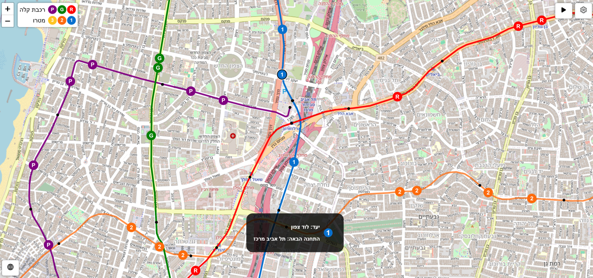
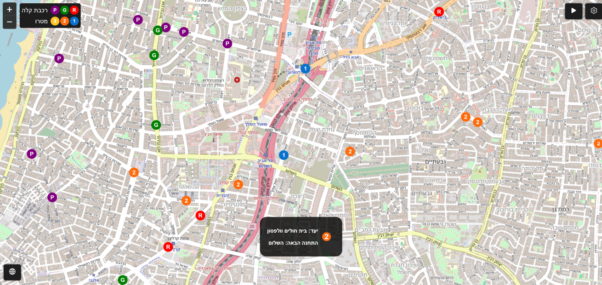
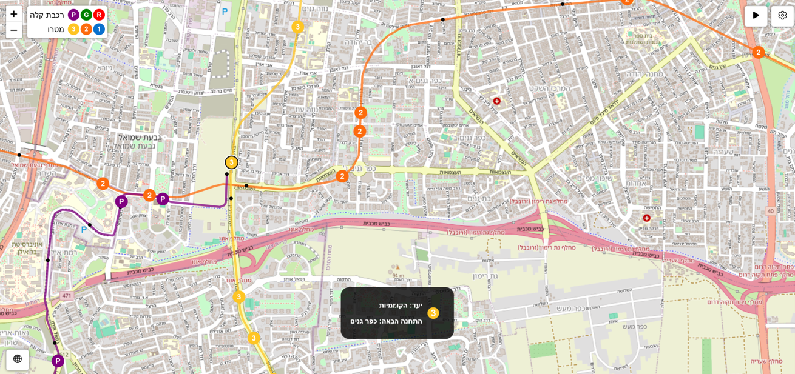

[](https://github.com/OmGaler/MadMetro/blob/master/README.md)

# מַדְמטרו: מדמה תחב\"צ באזור גוש דן

## סקירה כללית

מַדְמטרו הוא כלי סימולציה והדמיה אינטראקטיבי (מַדְמֶה), מבוסס דפדפן, המדמה את מערכת הסעת המונים העתידית באזור המטרופולין תל אביב-גוש דן. הסימולטור מציג הפעלות של קווי מטרו ורכבת קלה עם תנועות רכבות דינמיות, הדמיות של מסלולים ותחנות ותזמונים ניתנים להגדרה. מַדְמטרו נותן הצצה לעתיד השאפתני הזה, ומדגים כיצד המערכת עשויה לפעול.

## רקע

אזור המטרופולין תל אביב-גוש דן הוא האזור הצפוף והמאוכלס ביותר בישראל, ובשנת 2040 צפוי להיות משורת על ידי מערכת תחבורה המונית הכוללת 3 קווי רכבת קלה ו-3 קווי מטרו. קווי המטרו בלבד יכללו 109 תחנות על פני 150 ק"מ של מסילה, והמערכת כולה צפויה לשרת כ-4 מיליון נוסעים ביום.

## תכונות

- **הדמיית כלל הרשת:** הדמיה מלאה של מערכת התחבורה המונית המתוכננת בגוש דן, הכוללת את כל קווי המטרו והרכבת הקלה.
- **סימולציה בזמן אמת של תחבורה:** הדמיה דינמית של רכבי מטרו ורכבת קלה בתנועה לאורך מסלולם, בהתאם לתזמונים ודפוסי עצירה מציאותיים.
- **ממשק מפה אינטראקטיבי:** ניווט קל עם אפשרויות הזזה (פאן) והתקרבות/התרחקות (זום) באמצעות העכבר או מחוות מגע.
- **מידע מפורט על רכבות:** קבלת פרטי מסלול, התחנה הבאה והיעד על ידי לחיצה על כל רכבת.
- **הגדרות סימולציה :** כוונון מהירות הסימולציה, פרמטרי תזמון ואפשרויות תצוגה.
- **תמיכה רב-לשונית:** החלפה בין ממשקי אנגלית לעברית.

## צילומי מסך






## שימוש

1. **נסו אותו באינטרנט (מומלץ)**

> הדרך הקלה ביותר לנסות את מד-מטרו היא דרך GitHub Pages:
> [הפעל את מדמטרו](https://omgaler.github.io/MadMetro/)

2. **הפעלה מקומית**

   שכפלו את הריפו:
```
git clone https://github.com/OmGaler/MadMetro.git
```

נווטו לספריית הפרויקט:

```
cd MadMetro
```

הפעילו את מדמה:

- פתחו את ```index.html``` בדפדפן שלכם.
- או לחלופין, הפעילו שרת מקומי (למשל, באמצעות Python):

```
  python -m http.server 8040
```

לאחר מכן, פתחו את http://localhost:8040 בדפדפן.

### תאימות

מד-מטרו תואם לרוב הדפדפנים המרכזיים, הן במחשבים נייחים והן במכשירים ניידים, כולל Chrome ו-Safari. כדי לקבל ביצועים מיטביים וחוויית שימוש הטובה ביותר, ודאו שאתם משתמשים בגרסה עדכנית של הדפדפן שלכם.

### אינטראקציה עם מדמה

- **ניווט במפה:** לחץ וגרור להזזה, והשתמש בגלגל העכבר או במחוות מגע כדי לבצע זום.
- **בקרות סימולציה:**
- השהה/הפעל: השתמשו בלחצן בפינה העליונה הימנית, או לחצו על 'p' או 'space'.
- בקרת מהירות: כווננו את מהירות הסימולציה ואפשרויות נוספות בהגדרות.
- **מידע על רכבות:** לחצו על כל רכבת כדי לראות את מסלולה, התחנה הבאה והיעד.
- **קונפיגורציית לוח זמנים:** שנו את יום השירות (בין יום חול לסוף שבוע) ואת פרק הזמן בהגדרות כדי לצפות ברמות שירות אמיתיות.
- **שפה:** החליפו בין ממשקי אנגלית לעברית באמצעות סמל הגלובוס.

## מקורות נתונים

- **נתונים גאוגרפיים:** מיקומי תחנות והתאמות מסלולים שמקורם ב-[geo.mot.gov.il](https://geo.mot.gov.il) ובמאגרי מידע ציבוריים נוספים.
- **מפת בסיס:** אריחי המפה והנתונים מסופקים על ידי [OpenStreetMap.org](https://www.openstreetmap.org/).
- **עיבוד נתונים:** כל הנתונים עובדו מראש ואופטימליים למטרות סימולציה.

## הודעות סייג

> לוחות זמנים, תדירויות ומסלולים הם לצורך הדגמה והמחשה בלבד ואינם בהכרח תואמים לשירות במציאות. המדמה היא הערכה מקורבת ואינה משקפת פעולות תחבורה בזמן אמת או רשמיות באזור גוש דן.

- **דיוק:** לוחות הזמנים, התדירויות והמסלולים הם מקורבים ואינם בהכרח תואמים לשירותים המתוכננים או בפועל.
- **לא רשמי:** פרויקט זה אינו קשור ולא מאושר על ידי נת"ע, משרד התחבורה או כל רשות ממשלתית או תחבורתית אחרת.
- **מגבלות ביצועים:** למרות שכל המאמצים נעשו לאופטימיזציה של הביצועים, הכלי נועד למטרות חינוכיות ועלול שלא להתמודד עם מספר רב מאוד של רכבים מדומים ללא השפעות על הביצועים.
- **תבניות שמות ושירות:** שמות התחנות ותבניות השירות עשויים להשתנות ועלולים להיות שונים מגרסאות סופיות. תבניות שירות מסוימות עשויות להיות מופשטות למטרות הדמיה.

## שאלות, דיווחי באגים ובקשות לתכונות

אם יש לכם שאלות, נתקלתם בבאג, או שאתם מעוניינים להציע תכונה חדשה, אנא פתחו דיון ב-GitHub:  
[GitHub Issues](https://github.com/OmGaler/MadMetro/issues)

## רישיון

פרויקט זה מורשה בהתאם לתנאים המתוארים בקובץ [LICENSE](https://github.com/OmGaler/MadMetro/blob/master/LICENSE.md).