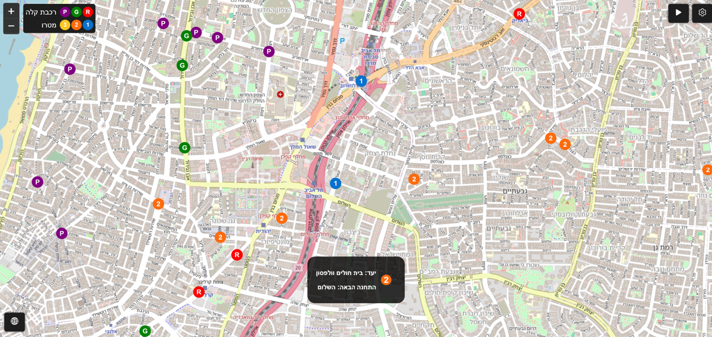

[](https://github.com/OmGaler/MadMetro/blob/master/README.md) [](https://github.com/OmGaler/MadMetro/blob/master/README-he.md)

# MadMetro - A Gush Dan Mass Transit Network Simulation & Visualisation

## Overview
MadMetro is an interactive, browser-based simulation and visualisation tool that models the future mass transit system in the Tel Aviv-Gush Dan Metropolitan Area. The simulator showcases metro and light rail operations with dynamic train movements, route and station visualisations and configurable scheduling. MadMetro provides a glimpse into this ambitious future, simulating how the network might operate.

## Background 
The Tel Aviv-Gush Dan Metropolitan Area is the densest and most populous in Israel and by 2040 is expected to be served by a mass transit system consisting of 3 light rail lines and 3 metro lines. The 3 metro lines alone will comprise 109 stations over 150 km of track and the system as a whole is expected to serve some 4 million passengers a day. MadMetro offers a glimpse into this ambitious future, showcasing how an advanced mass transit system might operate.

## Features
- Dynamic Simulation:
Watch metro and light rail vehicles in action as they serve their routes and stop at their stations.
- Configurable Scheduling:
Adjust service days (weekdays vs. weekends) and time periods directly from the settings to see how transit schedules adapt.
- Interactive Map:
Navigate the network easily using mouse or touch gestures for panning and zooming.
- Multilingual Support:
Switch between English and Hebrew by clicking the globe icon (note: translations are provided for clarity and may not be fully literal).
- Detailed Train Information:
Click on any train to view its current route, next stop, and destination.
- Custom Settings:
Modify simulation parameters, such as simulation speed and schedule settings, through the settings screen.

## Screenshots




## Usage
1. Try it Online (Recommended)

>[!TIP]
>The easiest way to try MadMetro is through GitHub Pages: [Launch MadMetro](https://omgaler.github.io/MadMetro/)
2. Run Locally
Clone the Repository:
```
git clone https://github.com/OmGaler/MadMetro.git
```
Navigate to the Project Directory:
```
cd MadMetro
```
Launch the Simulator:
- Open index.html in your web browser.
- Alternatively, run a local server (e.g., using Python):
```
# For Python 3.x
python -m http.server 8040
```
Then open http://localhost:8040 in your browser.

### Interacting with the Simulator
- Map Navigation:
  
  Pan and zoom using your mouse or touch gestures.
- Simulation Controls:
  
  Pause/Play: Toggle the simulation with the pause/play button (top right), or by pressing 'p' or 'space'.
- Schedule Settings: Change the service day and time period directly from the settings modal.
  
  Advanced Settings: Access further simulation parameters, such as simulation speed, via the settings modal.
- Train Information:
  
  Click on any train marker to reveal details like route information, the next stop, and the destination.
- Language Switching:
  
  Use the globe icon to toggle between English and Hebrew.

## Data Sources and Disclaimers
> [!WARNING]
> Schedules, frequencies, and routes are for demonstration purposes only and may not match real-world services
- Data Sources:
The simulation utilises route and station data sourced from [geo.mot.gov.il](geo.mot.gov.il) along with other public repositories. All data is preprocessed for simulation purposes. The map data is courtesy of [OpenStreetMap.org](https://www.openstreetmap.org/).
MadMetro uses synthesised and preprocessed data. The simulation is an approximation and does not reflect real-time or official transit operations in the Gush Dan region. The schedules, frequencies and operation details are indicative only, do not represent real-time or official endorsed transit operations, and are intended for demonstration only. Station names may be subject to change and certain service patterns may be subject to abstraction.
- Performance:
While every effort has been made to optimise performance, the tool is designed for educational purposes and may not handle very high numbers of simulated vehicles without performance impacts.
- No Official Endorsement:
This project is not affiliated with or endorsed by NTA, MOT or any governmental or transit authorities.
## License
This project is licensed under the terms described in the [LICENSE](https://github.com/OmGaler/MadMetro/blob/master/LICENSE.md) file.
