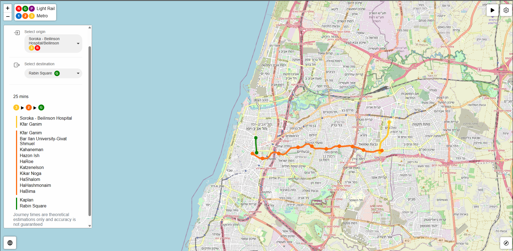

[](https://github.com/OmGaler/MadMetro/blob/master/README.md) [](https://github.com/OmGaler/MadMetro/blob/master/README-he.md)

# MadMetro - A Gush Dan Mass Transit Network Simulation & Visualisation

## Overview

MadMetro is an interactive, browser-based simulation and visualisation tool that models the future mass transit system in the Tel Aviv-Gush Dan Metropolitan Area. The simulator showcases metro and light rail operations with dynamic train movements, route and station visualisations and configurable scheduling. MadMetro provides a glimpse into this ambitious future, exhibiting how the system might operate.

## Background

The Tel Aviv-Gush Dan Metropolitan Area is the densest and most populous in Israel and by 2040 is expected to be served by a mass transit system consisting of 3 light rail lines and 3 metro lines. The metro lines alone will comprise 109 stations over 150 km of track and the system as a whole is expected to serve some 4 million passengers a day.

## Features

- **Whole Network Visualisation:** Complete visualisation of the planned Gush Dan mass transit network, including all metro and light rail lines.
- **Real-time Transit Simulation:** Dynamic visualisation of metro and light rail vehicles moving along their routes, adhering to realistic schedules and stopping patterns.
- **Interactive Map Interface:** Easy navigation with pan and zoom capabilities using mouse or touch gestures.
- **Detailed Train Information:** Access route details, next stop, and destination by clicking on any train.
- **Wayfinder**:Provides estimated journey times and optimal route details, including transfer information, between any two stations on the network.
- **Customisable Simulation Settings:** Adjust simulation speed, scheduling parameters, and view options.
- **Multilingual Support:** Toggle between English and Hebrew interfaces.

## Screenshots





## Usage

1. Try it Online (Recommended)

>[!TIP]
>The easiest way to try MadMetro is through GitHub Pages: [Launch MadMetro](https://omgaler.github.io/MadMetro/)

2. Run Locally

Clone the Repository:

```
git clone https://github.com/OmGaler/MadMetro.git
```

Navigate to the Project Directory:

```
cd MadMetro
```

Launch the Simulator:

- Open index.html in your web browser.
- Alternatively, run a local server (e.g., using Python):

```
# For Python 3.x
python -m http.server 8040
```

Then open http://localhost:8040 in your browser.

### Compatibility

MadMetro is compatible with most major browsers, on both desktop and mobile, include Chrome and Safari. For optimal performance and the best experience, ensure you are using a recent version of your browser.

### Interacting with the Simulator

- **Map Navigation:** Pan by clicking and dragging. Zoom with the scroll wheel, pinch gestures or with the +/- buttons.
- **Simulation Controls:**
  - Pause/Play: Use the button in the top right, or press 'p' or 'space'.
  - Speed Control: Adjust simulation speed and other options in settings.
- **Train Information:** Click any train to view its route, next stop, and destination.
- **Schedule Configuration:** Change service day (weekday/weekend) and time period in the settings to view real service levels.
- **Wayfinder**: Activate Wayfinder mode by clicking the compass button or pressing 'w'. Click on any two stations on the map, or use the dropdowns to give the estimated journey time between them, as well as detailed route information, including any necessary changes.
- **Language:** Switch between English and Hebrew using the globe icon.

## Data Sources

- **Geographic Data:** Station locations and route alignments sourced from [geo.mot.gov.il](https://geo.mot.gov.il) and other public repositories.
- **Base Map:** Map tiles and data provided by [OpenStreetMap.org](https://www.openstreetmap.org/).
- **Data Processing:** All data has been preprocessed and optimised for simulation purposes.

## Transport Physics & Routing Logic

#### Train Allocation & Frequency

The number of trains per line is calculated based on:

- Average line speed estimated across the entire route
- Required service headways (time interval between consecutive trains)
- Total route length and expected round-trip times

#### Journey Time Estimations

Each segment's travel time incorporates (up to) three phases:

- Acceleration phase: Time (and distance) required for a train to reach top speed using specified acceleration rates
- Cruising phase: Time (and distance) spent traveling at maximum velocity when segment length permits
- Deceleration phase: Time (and distance) needed for the train to slow down and stop at the next station

The kinematics-based travel times are augmented with heuristic multiplier adjustments and dwell time buffers to account for operational delays, passenger boarding/alighting, and other real-world factors that affect service reliability. Despite this, all journey times should be treated as indicative estimations only.

> [!WARNING]
> Due to the complexity of real-world transport systems and unpredictable factors, these calculated times are likely to diverge from actual operational performance.

#### Network Pathfinding

The network is modeled as a weighted graph where:

- **Nodes** represent stations
- **Edges** represent the connection segments between adjacent stations, weighted by distance
- **Edge properties** include type (underground/above-ground light rail or  metro) which determines applicable speed profiles and consequently affects calculated travel times

##### Routing Algorithm
Journey times and shortest routes between any two stations is computed by Dijkstra's algorithm, which is simple, effective and efficient. The algorithm returns the optimal route to take as well as the estimated journey time.
This method efficiently handling complex network topologies including transfers between lines while balancing computational efficiency with route optimisation accuracy.

## Disclaimers

> [!WARNING]
> Schedules, frequencies, and routes are indicative only for demonstration purposes and may not match real-world services. The simulation is an approximation and does not reflect real-time or official transit operations in the Gush Dan region.

- **Accuracy:** Schedules, frequencies, and routes are approximations and may not match planned or actual services.
- **Journey Time Estimation:** Calculated travel times incorporate theoretical physics models with approximate adjustments for real-world factors. These times should be considered indicative only and may significantly differ from actual journey durations due to operational variability, service disruptions, passenger volumes, and other external factors beyond the scope of this simulation.
- **Not Official:** This project is not affiliated with or endorsed by NTA, MOT, or any other governmental or transit authority.
- **Performance Limitations:** While every effort has been made to optimise performance, the tool is designed for educational purposes and may not handle very high numbers of simulated vehicles without performance impacts.
- **Naming and Service Patterns:** Station names and service patterns are subject to change and may differ from final implementations. Certain service patterns may be subject to abstraction for simulation purposes.
- **Track Representation:** The app only displays tracks used for passenger services. Depots, sidings, and other non-revenue tracks are omitted.

## Questions, Bug Reports, and Feature Requests

If you have any questions, encounter a bug, or would like to request a new feature, please open an issue on GitHub:  
[GitHub Issues](https://github.com/OmGaler/MadMetro/issues)

## License

This project is licensed under the terms described in the [LICENSE](https://github.com/OmGaler/MadMetro/blob/master/LICENSE.md) file.
